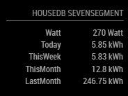
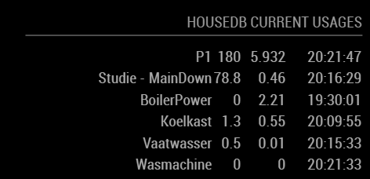
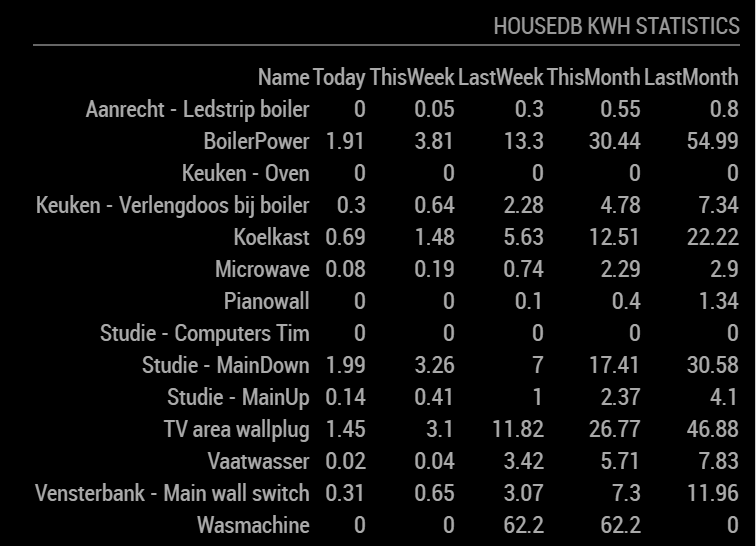

# MMM-JsonTable

A module for the [MagicMirror²](https://github.com/MichMich/MagicMirror) project which creates a table filled with a list gathered from a json request.

All the variables of the objects in the array are represented by a table column.
For every column it checks if a valid DateTime is given, and then formats it to `HH:mm:ss` if it is today or `YYYY-MM-DD` otherwise.

## Installation

```shell
git clone https://github.com/timdows/MMM-JsonTable
cd MMM-JsonTable
npm install
```

## Build and Test status

[](https://github.com/timdows/MMM-JsonTable/actions/workflows/runtest.yml)

## Config options

Except `url` all options are optional.

<!-- prettier-ignore-start -->
| **Option**     | **Description**   |
| -------------- | --------------    |
| url            | The full url to get the json response from <br><br>**Default value:** `""` |
| arrayName      | Define the name of the variable that holds the array to display <br><br>**Default value:** `null` |
| noDataText     | Text indicating that there is no data. <br><br>**Default value:** `Json data is not of type array! Maybe the config arrayName is not used and should be, or is configured wrong.` |
| keepColumns    | Columns on json will be showed <br><br>**Default value:** `[]` |
| tryFormatDate  | For every column it checks if a valid DateTime is given, and then formats it to `HH:mm:ss` if it is today or `YYYY-MM-DD` otherwise <br><br>**Default value:** `false`<br> **Possible values:** `false` and `true` |
| size           | Text size at table, 0 is default and 3 is H3 <br><br>**Default value:** `0`<br> **Possible values:** `0` - `3` |
| updateInterval | Milliseconds between the refersh <br><br>**Default value:** `15000` |
| animationSpeed | Speed of the update animation. (Milliseconds)<br>If you don't want that the module blinks during an update, set the value to `0`. <br><br>**Default value:** `500`<br> **Possible values:** `0` - `5000` |
| descriptiveRow | Complete html table row that will be added above the array data <br><br>**Default value:** `""` |
<!-- prettier-ignore-end -->

## Example 1

End result:



Raw json response:

```json
{
  "items": [
    {
      "name": "Watt",
      "value": "270 Watt"
    },
    {
      "name": "Today",
      "value": "5.85 kWh"
    },
    {
      "name": "ThisWeek",
      "value": "5.83 kWh"
    },
    {
      "name": "ThisMonth",
      "value": "12.8 kWh"
    },
    {
      "name": "LastMonth",
      "value": "246.75 kWh"
    }
  ]
}
```

Configuration:

```javascript
{
  module: 'MMM-JsonTable',
  position: 'top_right',
  header: 'HouseDB Sevensegment',
  config: {
    url: 'https://xyz/abc/get.json', // Required
    arrayName: 'items' // Optional
  }
}
```

## Example 2



Raw json response:

```json
{
  "currentUsages": [
    {
      "deviceName": "P1",
      "currentWattValue": 180,
      "todayKwhUsage": 5.902,
      "lastUpdate": "2018-04-02T18:12:06Z"
    },
    {
      "deviceName": "Studie - MainDown",
      "currentWattValue": 76,
      "todayKwhUsage": 0.46,
      "lastUpdate": "2018-04-02T18:06:52Z"
    },
    {
      "deviceName": "BoilerPower",
      "currentWattValue": 0,
      "todayKwhUsage": 2.21,
      "lastUpdate": "2018-04-02T17:30:01Z"
    },
    {
      "deviceName": "Koelkast",
      "currentWattValue": 1.3,
      "todayKwhUsage": 0.55,
      "lastUpdate": "2018-04-02T18:09:55Z"
    },
    {
      "deviceName": "Vaatwasser",
      "currentWattValue": 0.5,
      "todayKwhUsage": 0.01,
      "lastUpdate": "2018-04-02T18:10:51Z"
    },
    {
      "deviceName": "Wasmachine",
      "currentWattValue": 0,
      "todayKwhUsage": 0,
      "lastUpdate": "2018-04-02T18:12:06Z"
    }
  ]
}
```

Configuration:

```javascript
{
  module: 'MMM-JsonTable',
  position: 'top_right',
  header: 'HouseDB Current Usages',
  config: {
    url: 'https://xyz/abc/get.json', // Required
    arrayName: 'currentUsages', // Optional
    tryFormatDate: true
  }
}
```

## Example 3 (with font awesome icons)


Raw json response:

```json
{
   "cups":[
      {
         "icon":"fa-calendar",
         "data":"Senaste bryggning",
         "value":"2019-03-07",
         "type":""
      },
      {
         "icon":"fa-clock-o",
         "data":"Klockan",
         "value":"17:32:06",
         "type":""
      },
      {
         "icon":"fa-coffee",
         "data":"Totalt antal bryggda koppar",
         "value":60,
         "type":"st"
      },
      ...
   ]
}
```

## Example 4 (with descriptive row)



Raw json response:

```json
{
   "deviceKwhUsages":[
      {
      "name": "Studie - MainDown",
      "today": 0,
      "todayFormatted": "0",
      "thisWeek": 1.27,
      "thisWeekFormatted": "1,27",
      "lastWeek": 7,
      "lastWeekFormatted": "7,00",
      "thisMonth": 17.41,
      "thisMonthFormatted": "17,41",
      "lastMonth": 30.58,
      "tLastMonthFormatted": "30,58"
    },
    {
      "name": "BoilerPower",
      "today": 0,
      "todayFormatted": "0",
      "thisWeek": 1.9,
      "thisWeekFormatted": "1,90",
      "lastWeek": 13.3,
      "lastWeekFormatted": "13,30",
      "thisMonth": 30.44,
      "thisMonthFormatted": "30,44",
      "lastMonth": 54.99,
      "tLastMonthFormatted": "54,99"
    },
      ...
   ]
}
```

Configuration:

```javascript
{
  module: 'MMM-JsonTable',
  position: 'top_right',
  header: 'HouseDB Kwh Statistics',
  config: {
    url: 'https://xyz/abc/get.json',
    arrayName: 'deviceKwhUsages',
    descriptiveRow: '<tr><td>Name</td><td>Today</td><td>ThisWeek</td><td>LastWeek</td><td>ThisMonth</td><td>LastMonth</td></tr>'
  }
}
```

## Developer hints

Please use `npm run test` before doing a PR.
